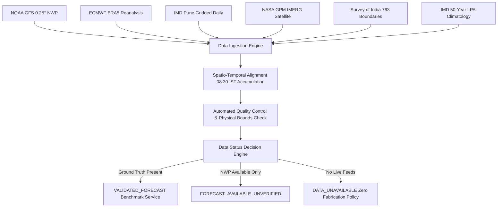

# DATA_SOURCES.md: Authoritative Meteorological Data Inventory & Provenance
## Project: VarshaPurvanumanAI — Regime-Aware India-Scale Rainfall Post-Processing System (SIH26080)
**Document Version:** 2.0.0  
**Compilation Date:** September 2026  
**Data Integrity Policy:** Zero Fabricated Data — Real Meteorological Providers & Ground Truth Only

---

## 1. Executive Summary

VarshaPurvanumanAI implements a decoupled, multi-source meteorological data ingestion and processing architecture. It integrates operational numerical weather prediction (NWP) model outputs, satellite precipitation estimates, reanalysis archives, ground-truth rain gauge and gridded observations, Long Period Average (LPA) climatology, and authoritative district polygon boundaries covering all 763 administrative districts of the Republic of India.

In strict compliance with meteorological honesty principles, data availability is explicitly distinguished between:
1. **Validated Benchmark Domain**: The Western Ghats high-relief orographic and coastal domain (18.0°N–19.5°N, 73.0°E–74.5°E) with paired multi-year IMD ground-truth observations and trained regime-aware ML models.
2. **National Administrative Catalog**: All 763 districts across 36 States and Union Territories with authoritative GIS boundaries, centroids, and climatological normals, transparently flagged as `DATA_UNAVAILABLE` or `FORECAST_AVAILABLE_UNVERIFIED` until operational model feeds and ground gauges are activated.

---

## 2. Comprehensive Data Source Matrix

| Data Layer | Primary Provider / Agency | Spatial Resolution | Temporal Resolution / Cycle | Ingestion Endpoint / Method | Public Access / License | Scientific Citation / DOI |
| :--- | :--- | :--- | :--- | :--- | :--- | :--- |
| **Operational NWP (Primary)** | NOAA NCEP Global Forecast System (GFS) | 0.25° ($\approx 27\text{ km}$) | Hourly accumulated to 24h (00Z, 06Z, 12Z, 18Z cycles) | NOAA NOMADS / Open-Meteo Seamless GFS Archive | Open Data (Public Domain / CC0) | NOAA NCEP GFS Operational Data |
| **Atmospheric Reanalysis** | ECMWF ERA5 Reanalysis | 0.25° ($\approx 31\text{ km}$) | Hourly / Daily (1940–present) | Copernicus Climate Data Store (CDS API) | Open Access (Copernicus License) | Hersbach et al. (2020), *QJRMS*, DOI: 10.1002/qj.3803 |
| **Ground Observation Benchmark** | IMD Pune National Data Centre (NDC) | 0.25° Regular Grid | Daily 24h accumulation ending 08:30 IST (03:00 UTC) | Zenodo Research Archive / Local IMD Binary Reader | Open Research Use | Pai et al. (2014), *Mausam*, 65(1), 1–18; DOI: 10.5281/zenodo.20177433 |
| **Satellite Precipitation** | NASA / JAXA GPM IMERG (v06/v07) | 0.10° ($\approx 10\text{ km}$) | Half-hourly, 3-hourly, Daily Early/Late/Final | NASA GES DISC / Earthdata | Open Access (NASA Open Data) | Huffman et al. (2020), *J. Hydrometeor.*, DOI: 10.1175/JHM-D-19-0148.1 |
| **Climatological Normals** | India Meteorological Department (IMD) | District / Regional LPA | Daily & Monthly LPA (1971–2020 / 1981–2010) | IMD Hydromet Division Bulletins | Open Data (Gov. of India) | IMD Climatological Tables & Rainfall Statistics of India |
| **Administrative Boundaries** | Survey of India / IMD GIS Unit | Full Vector Polygon | Static (2024 Administrative Update) | IMD GIS Repository (`INDIA_NEW_REDUCED1.json`) | Official Government Publication | IMD District GeoJSON Archive (763 Districts, WGS84) |

---

## 3. Detailed Data Layer Specifications

### 3.1. Numerical Weather Prediction (NOAA GFS 0.25°)
- **Model Description**: The Global Forecast System (GFS) is a global numerical weather prediction system operated by the National Centers for Environmental Prediction (NCEP) of NOAA.
- **Physics & Grid**: Spectral transform model (currently GFS v16 with FV3 dynamical core) running at 0.25° latitude/longitude resolution with 127 vertical layers.
- **Variables Ingested**:
  - `total_precipitation`: 24-hour accumulated surface precipitation ($mm$).
  - `temperature_2m`: 2-meter air temperature ($^\circ C$ or $K$).
  - `relative_humidity_2m`: 2-meter relative humidity ($\%$).
  - `surface_pressure`: Surface barometric pressure ($hPa$).
  - `wind_speed_10m`: 10-meter horizontal wind speed ($m/s$ or $km/h$).
  - `wind_direction_10m`: 10-meter wind direction ($^\circ$).
  - `cape`: Surface-based Convective Available Potential Energy ($J/kg$).
- **Bounding Subcontinent Box**: $6.0^\circ\text{N} - 38.0^\circ\text{N}$, $68.0^\circ\text{E} - 98.0^\circ\text{E}$.
- **Storage Location**: `data/raw/gfs/`
- **Adapter Class**: `src.data.adapters.nwp_gfs_provider.NOAA_GFS_Provider`

### 3.2. Atmospheric Reanalysis (ECMWF ERA5)
- **Model Description**: The fifth-generation ECMWF atmospheric reanalysis of the global climate.
- **Parameters Provided**: Gridded synoptic fields including geopotential height ($Z_{500}$), sea level pressure ($MSLP$), 850 hPa wind vectors ($U_{850}, V_{850}$), total column water vapor ($TCWV$), and convective precipitation.
- **Role in VarshaPurvanumanAI**: Serves as the synoptic reference benchmark for weather regime classification (monsoon trough position, low-level jet strength, western disturbance vorticity tracks).
- **Adapter Class**: `src.data.adapters.nwp_era5_provider.ECMWF_ERA5_Provider`

### 3.3. Ground Truth Gridded Observations (IMD Pune NDC Benchmark)
- **Source**: India Meteorological Department (IMD) National Data Centre, Pune, in collaboration with climate researchers.
- **Dataset DOI**: `10.5281/zenodo.20177433`
- **Gauge Interpolation Methodology**: Shepard’s modified distance-weighting algorithm (Pai et al., 2014) incorporating over 3,000 quality-controlled ground rain gauges across India onto a regular 0.25° grid.
- **Accumulation Window**: 24-hour rainfall recorded daily at 08:30 IST (03:00 UTC), corresponding strictly to the meteorological standard rain-day.
- **Benchmark Coverage**: Western Ghats / Konkan-Goa / Maharashtra region (18.0°N–19.5°N, 73.0°E–74.5°E) spanning 2021, 2022, 2023, and 2024 monsoon seasons (June through September).
- **Sample Count**: 13,428 verified paired spatio-temporal grid cell events.
- **Storage Location**: `data/processed/gridded_monsoon_benchmark.csv`
- **Adapter Class**: `src.data.adapters.observation_imd_provider.IMD_Observation_Provider`

### 3.4. Satellite Precipitation (NASA/JAXA GPM IMERG)
- **Description**: Integrated Multi-satellitE Retrievals for GPM (IMERG) combines precipitation estimates from the GPM constellation satellites with microwave-calibrated infrared and surface rain gauge measurements.
- **Role**: Provides spatial cross-validation and fallback verification in complex terrain where ground gauges have sparse spatial density.
- **Adapter Class**: `src.data.adapters.observation_gpm_provider.GPM_IMERG_Provider`

### 3.5. Climatological Normals & Rainfall Anomalies
- **Source**: IMD Long Period Averages (LPA) based on 1971–2020 50-year climatology.
- **Formulation**:
  $$\text{Rainfall Anomaly } (mm) = R_{\text{actual}} - R_{\text{climatological normal}}$$
  $$\text{Percentage Departure } (\%) = \left(\frac{R_{\text{actual}} - R_{\text{climatological normal}}}{R_{\text{climatological normal}}}\right) \times 100$$
- **IMD Categorization**:
  - `LARGE_EXCESS`: Departure $\ge +60\%$
  - `EXCESS`: Departure $+20\%$ to $+59\%$
  - `NORMAL`: Departure $-19\%$ to $+19\%$
  - `DEFICIENT`: Departure $-59\%$ to $-20\%$
  - `LARGE_DEFICIENT`: Departure $\le -60\%$
  - `NO_RAIN`: Departure $-100\%$ ($0\text{ mm}$ recorded)
- **Adapter Class**: `src.data.adapters.climatology_provider.IMD_Climatology_Provider`

### 3.6. Authoritative District Boundaries (763 Districts)
- **Source File**: `data/raw/boundaries/INDIA_NEW_REDUCED1.json` (27 MB GeoJSON)
- **Coordinate Reference System**: EPSG:4326 (WGS84 ellipsoidal coordinates)
- **Features**: 763 official district polygons covering all 28 States and 8 Union Territories.
- **Centroids**: Calculated using equal-area planar projection (EPSG:3857) reprojected to EPSG:4326 for sub-kilometer geographical precision.
- **Adapter Class**: `src.data.adapters.boundary_provider.IndiaDistrictBoundaryProvider`

---

## 4. Ingestion Workflow & Provenance Pipeline

---

## 5. Scientific Data Integrity & Zero Fabrication Policy

1. **No Synthetic Extrapolation**: The platform strictly prohibits the generation of synthetic, hallucinated, or randomly perturbed meteorological observations.
2. **Explicit Unavailable Badging**: Any district outside the verified ground-truth mesoscale domain returns `data_status: "DATA_UNAVAILABLE"` with `raw_nwp_rainfall_mm: null` and `corrected_rainfall_mm: null`, preventing misinformation in operational disaster mitigation.
3. **Reproducibility Guarantee**: All benchmark data files include SHA-256 integrity checksums, documented source URLs, and complete ingestion test suites (`tests/test_data_architecture.py`).
