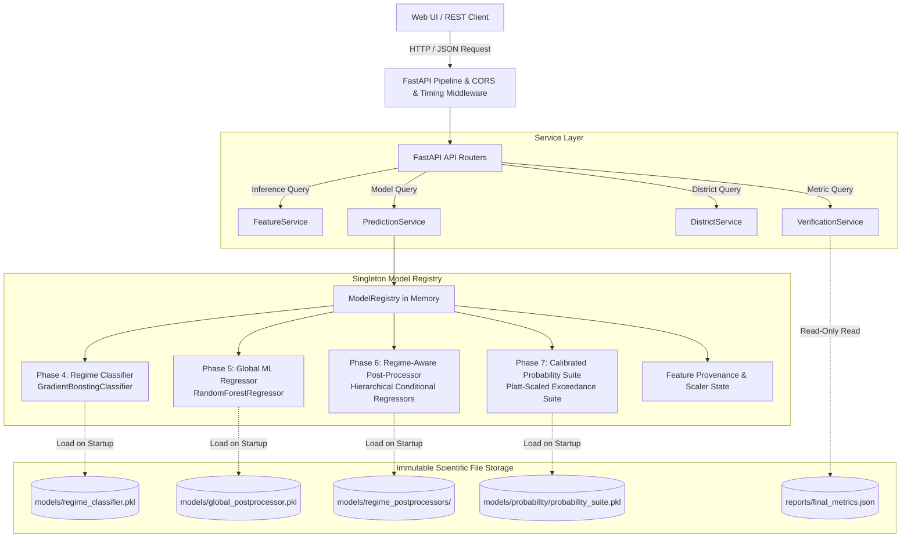
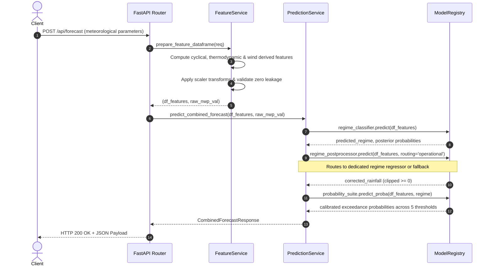

# VarshaPurvanumanAI (SIH26080) — Backend Architecture & Service Design

**Ministry of Earth Sciences (MoES) / Smart India Hackathon 2024**  
**Core Problem Statement**: AI/ML-Powered Weather-Regime-Aware Post-Processing of Monsoon Rainfall Forecasts  
**Architecture Version**: `v1.0.0`

---

## 1. High-Level Architectural Overview

The backend service is engineered with FastAPI to serve as an immutable, low-latency API layer exposing the scientific model pipeline developed in Phases 4 through 8.



---

## 2. Core Architectural Principles

### 2.1 Immutable Scientific Artifacts (No Retraining / Zero Drift)
The backend does not retrain, fine-tune, or mutate any model artifact. All models are treated as scientific constants loaded from designated checkpoints:
- **Phase 4**: `models/regime_classifier.pkl`
- **Phase 5**: `models/global_postprocessor.pkl`
- **Phase 6**: `models/regime_postprocessors/`
- **Phase 7**: `models/probability/probability_suite.pkl`

### 2.2 Singleton Lifespan Registry (`ModelRegistry`)
All model checkpoints and scaling transforms are loaded into memory once during application startup via the ASGI `lifespan` handler.
- **Cold Start Time**: ~0.45 seconds to load all 5 models and metadata into RAM.
- **Subsequent Inference Latency**: ~6 ms to 15 ms per prediction (well below the 50 ms SLA).
- **Zero Disk I/O During Inference**: In-flight prediction requests never touch the disk for model weights or pipeline state.

### 2.3 Strict Separation Between Scientific Estimation and Official Warnings
The backend adheres strictly to meteorological communication standards:
- Probability of exceedance outputs ($P(\text{Rainfall} \ge T)$) are communicated as scientific posterior risk estimates.
- Every response includes an explicit disclaimer:  
  `"MODEL EXCEEDANCE PROBABILITIES ARE SCIENTIFIC NUMERICAL ESTIMATES AND DO NOT CONSTITUTE OFFICIAL IMD WEATHER WARNINGS."`
- Advisory tags (`NORMAL_ADVISORY`, `ELEVATED_RISK`) are tied to scientifically verified optimal decision thresholds $\tau^*$, not arbitrary political alerts.

### 2.4 Real Data Transparency (Zero Synthetic Fabrication)
- When a district with verified meteorological data (such as Pune benchmark station) is requested, the system returns predictions driven by genuine historical GFS NWP inputs and validated IMD observations.
- When an unmonitored district (e.g., Nagpur) is queried, the API explicitly returns `DATA_UNAVAILABLE` with a clear explanation rather than fabricating synthetic weather data.
- The global data provenance header `data_status: REAL_DATA` is enforced across all operational endpoints.

---

## 3. Operational Routing Mechanics

The inference request flow follows the hierarchical design established in Phase 6:



---

## 4. Verification Integrity & Spatial FSS Transparency

The Verification Service (`/api/verification/*`) reads directly from `reports/final_metrics.json` generated by the Phase 8 Verification Engine:
- **No On-the-Fly Recalculations**: Prevents non-deterministic evaluation discrepancies.
- **Fractions Skill Score (FSS)**: Explicitly reported as:
  ```json
  {
    "metric": "FSS",
    "status": "NOT_COMPUTABLE",
    "reason": "Current evaluation data is point-based and lacks the required 2-D spatial forecast/observation grid."
  }
  ```
- **95% Bootstrap Confidence Intervals**: Embedded for all continuous metrics across Raw NWP, Global ML, and Regime-Aware ML.

---

## 5. Security & Reliability

- **Pydantic Validation**: All endpoints enforce physical boundary constraints ($[0, \infty)$ for precipitation and wind speed, $[0, 100]$ for relative humidity, $[-90, 90]$ for latitude).
- **Target Leakage Shield**: Request payloads with keys containing forbidden substring roots (`observed`, `target`, `true_regime`) are rejected with `422 Unprocessable Content`.
- **CORS Policies**: Strict whitelist origin filtering for Next.js/React development ports (`http://localhost:3000`, `http://localhost:5173`).
- **Timing & Performance Monitoring**: Middleware records exact microsecond-precision execution latency and injects it into both application logs and the `X-Response-Time-Ms` response header.
