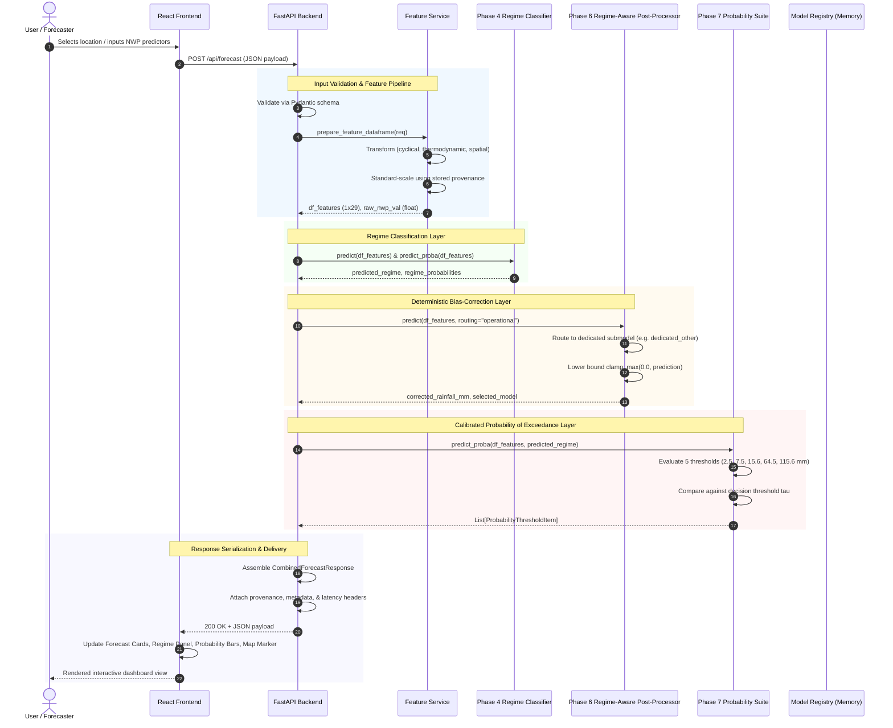
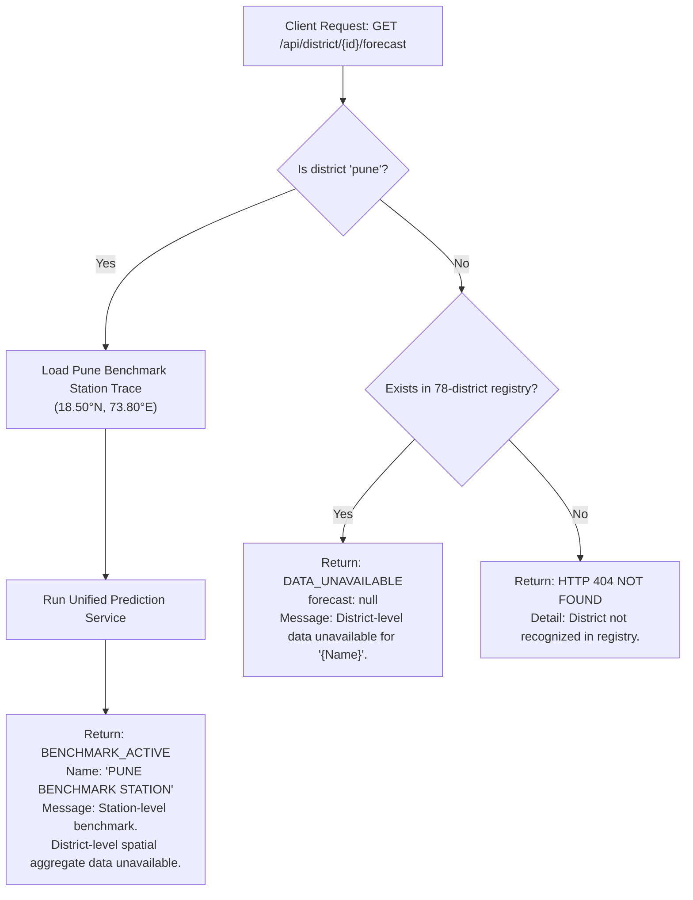

# VarshaPurvanumanAI — Data Flow Architecture
**SIH26080: Regime-Aware AI Post-Processing of Monsoon Rainfall Forecasts**  
**Ministry of Earth Sciences (MoES) / India Meteorological Department (IMD)**

---

## 1. End-to-End Data Flow Pipeline

The system processes meteorological observations and numerical forecasts through a sequential, zero-leakage pipeline that bridges physical NWP outputs with operational AI post-processing and client presentation.

---

## 2. Ingestion & Alignment Flow

1. **Daily Observations**:
   - Source: IMD 0.25° $\times$ 0.25° gridded daily rainfall data.
   - Units: Millimeters per day ($\text{mm/day}$).
   - 24-hour accumulation ending at 08:30 IST (03:00 UTC).
2. **Numerical Weather Prediction (NWP)**:
   - Source: NOAA GFS / IMD Global Model 0.25° forecasts.
   - Lead time: Day-1 ($+24\text{h}$) to Day-5 ($+120\text{h}$).
3. **Spatial & Temporal Pairing**:
   - Point extraction for benchmark coordinates (18.50°N, 73.80°E).
   - Strict temporal pairing on timestamp without lookahead.
4. **Chronological Splitting**:
   - **Train**: JJAS 2021 & JJAS 2022 ($N = 244$).
   - **Validation**: JJAS 2023 ($N = 122$) — used exclusively for hyperparameter tuning and Platt probability calibration.
   - **Test**: June 1 – June 30, 2024 ($N = 31$) — held-out benchmark evaluation.

---

## 3. Operational Forecast Inference Flow

### Step 1: Client Request
The client submits either:
- **Raw physical parameters**: `nwp_rainfall`, `wind_speed_ms`, `u_wind_10m`, `v_wind_10m`, `temperature_2m`, `relative_humidity_2m`, `surface_pressure`, `cape`, `month`, `day_of_year`, `latitude`, `longitude`.
- **Pre-engineered features dictionary**: Direct 29-feature dictionary matching the training matrix.

### Step 2: Input Validation (FastAPI / Pydantic)
- `nwp_rainfall \ge 0.0\text{ mm}`.
- `relative_humidity_2m \in [0.0, 100.0]\%`.
- `surface_pressure \in (500.0, 1100.0)\text{ hPa}`.
- Target/leakage column prohibition: Reject requests containing forbidden keys (`observed`, `target`, `label`, `true_regime`).

### Step 3: Feature Engineering & Normalization
- Compute dew point depression: $DP_{\text{dep}} \approx (100 - RH) / 5.0$.
- Compute convective vertical velocity scale: $W_{\max} = \sqrt{2 \cdot \max(0, CAPE)}$.
- Trigonometric cyclical encoding for day of year and month.
- Geographic zoning flags (`in_core_monsoon_zone`, `in_western_ghats_belt`, `in_northeast_hills`).
- Z-score normalization using parameters stored in `feature_pipeline_provenance.json`:
  $$z_i = \frac{x_i - \mu_i}{\sigma_i}$$

### Step 4: Weather Regime Classification
- Feature vector is evaluated by the Phase 4 `GradientBoostingClassifier`.
- Outputs:
  1. Discrete predicted regime: $\hat{R} \in \{\text{ACTIVE\_MONSOON}, \text{BREAK\_MONSOON}, \text{COASTAL\_OROGRAPHIC}, \text{DEPRESSION}, \text{OTHER}\}$.
  2. Posterior probability distribution over all 5 regimes.

### Step 5: Regime-Aware Deterministic Post-Processing
- The operational router dynamically dispatches the feature vector to the regressor assigned to $\hat{R}$:
  - If a dedicated submodel exists for $\hat{R}$, it computes the bias correction.
  - If $\hat{R}$ has insufficient training support or is missing, the system gracefully falls back to `fallback_model.pkl` (`RandomForestRegressor`).
- Non-negative physical constraint is enforced:
  $$\hat{y}_{\text{corrected}} = \max(0.0, \hat{y}_{\text{raw\_model}})$$

### Step 6: Calibrated Probability of Exceedance
- For each verified threshold $T \in \{2.5, 7.5, 15.6, 64.5, 115.6\}\text{ mm}$:
  - The Platt-calibrated sigmoid model estimates $P(Y \ge T \mid \mathbf{x}, \hat{R})$.
  - Probability is clamped strictly to $[0.0, 1.0]$.
  - The probability is evaluated against the validation-optimized decision threshold $\tau$:
    $$\text{Advisory} = \begin{cases} \text{ELEVATED\_RISK} & \text{if } P \ge \tau \\ \text{NORMAL\_ADVISORY} & \text{if } P < \tau \end{cases}$$

### Step 7: Response Assembly
- The payload is serialized with metadata:
  - `model_metadata`: Model versions, algorithms, and selected submodel.
  - `data_status`: `REAL_DATA`.
  - `prediction_source`: `verified_model_artifacts`.
  - `timestamp`: ISO 8601 UTC timestamp.
  - Response headers: `X-Response-Time-Ms` (latency benchmark), `X-Data-Status`.

---

## 4. District Lookup and Data Isolation Flow

### Safety Guarantees
1. **Zero Spatial Fabrication**: Pune station values are **never** attributed as the spatial mean for Pune district.
2. **Transparent Non-Availability**: Districts without dedicated sensors or benchmark data return `forecast: null` and `coverage_status: "DATA_UNAVAILABLE"`.
3. **No Synthetic Null Fallbacks**: The frontend displays `DISTRICT-LEVEL DATA UNAVAILABLE` and never substitutes `0.0 mm` or `0%` for unmonitored locations.
