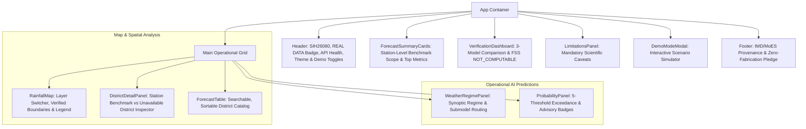

# VarshaPurvanumanAI (SIH26080) — Frontend Architecture & UI Design

**Ministry of Earth Sciences (MoES) / Smart India Hackathon 2024**  
**Core Problem Statement**: AI/ML-Powered Weather-Regime-Aware Post-Processing of Monsoon Rainfall Forecasts  
**Architecture Version**: `v1.0.0`

---

## 1. Executive Summary & Technology Stack

The VarshaPurvanumanAI frontend is built as a meteorological decision-support control center. It connects directly to the Phase 9 FastAPI REST backend and provides an interactive interface for inspecting operational weather regime classifications, AI bias-corrected rainfall forecasts, calibrated heavy-rainfall exceedance probabilities, and Phase 8 verification benchmarks.

- **Framework**: React 19 with TypeScript
- **Build Tool**: Vite v8
- **Styling**: Tailwind CSS v4 (designed according to `awesome-design-md` meteorological design tokens)
- **Mapping & GIS**: Leaflet v1.9 + React-Leaflet v5 (with verified administrative GeoJSON boundaries and centroid markers)
- **Icons**: Lucide-React
- **Testing**: Vitest + React Testing Library + JSDOM

---

## 2. Component Hierarchy & Flow

---

## 3. Strict Real Data & Scope Enforcement

### 3.1 Point Station vs Spatial District Scope
- The quantitative evaluation and real-time operational model apply strictly to the **PUNE BENCHMARK STATION (18.50°N, 73.80°E)**.
- To prevent scientific misrepresentation, the dashboard **never** attributes point-station predictions to the entire Pune district polygon or neighboring administrative districts without verified gridded spatial data.
- Non-monitored districts transparently display:
  `"DISTRICT-LEVEL DATA UNAVAILABLE"`
  with zero synthetic weather fabrication.

### 3.2 Spatial Verification (FSS) Transparency
- In accordance with World Meteorological Organization (WMO) and IMD standards, the Fractions Skill Score (FSS) is explicitly rendered as:
  **`NOT COMPUTABLE`**
  with the reason:
  *"Current evaluation data is point-based and does not provide the required 2-D spatial forecast/observation grid."*

### 3.3 Heavy-Rainfall Limited Validation Badges
- For thresholds $\ge 64.5\text{ mm}$ (Heavy Rain) and $\ge 115.6\text{ mm}$ (Very Heavy Rain), the UI displays a prominent warning:
  **`Limited validation data (0 test events)`**
  reflecting the fact that the June 2024 held-out test cohort had zero observed events at these extreme thresholds.

---

## 4. API Client & State Management

The frontend connects to the backend through a typed client (`frontend/src/api/client.ts`):
- Handles network timeouts and RFC 7807 validation error formatting.
- Automatically polls `/api/health` to update the connection indicator.
- Manages an isolated **`DEMO DATA`** mode for SIH jury presentations that simulates meteorological scenarios without modifying real scientific test records.
