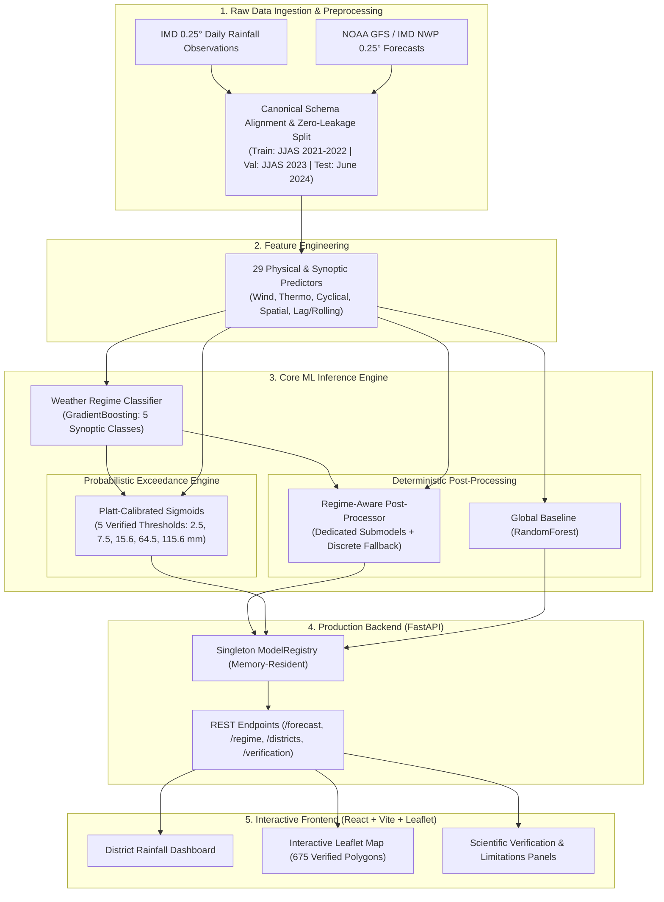

# VarshaPurvanumanAI — Full System Architecture
**SIH26080: Regime-Aware AI Post-Processing of Monsoon Rainfall Forecasts**  
**Ministry of Earth Sciences (MoES) / India Meteorological Department (IMD)**

---

## 1. Executive Summary

VarshaPurvanumanAI is an operational AI/ML post-processing system engineered to improve Numerical Weather Prediction (NWP) rainfall forecasts across the Indian subcontinent during the Southwest Monsoon (JJAS). By conditioning post-processing routines on synoptic weather regimes and integrating calibrated probability of exceedance models, the system addresses systematic NWP biases and conditional mean shrinkage in heavy rainfall events.



---

## 2. Component Subsystem Architecture

### 2.1 Ingestion and Canonical Preprocessing
- **Source Repositories**:
  - `data/raw/zenodo_sample/`: Zenodo IMD 0.25° gridded rainfall observations.
  - `data/raw/gfs/`: GFS 0.25° NWP forecast grids.
  - `data/raw/boundaries/DISTRICT_F-2.json`: 675 authentic administrative polygons.
- **Canonical Schema**: Defined in `src/ingestion/canonical_schema.py`. Enforces standardized column names, non-negative rainfall constraints, and strict WGS84 coordinate boundaries.
- **Data Splitting Strategy**: Strict chronological ordering to eliminate temporal data leakage:
  - **Training Set**: JJAS 2021 & JJAS 2022 (244 samples)
  - **Validation Set**: JJAS 2023 (122 samples)
  - **Held-Out Test Set**: June 1 – June 30, 2024 (31 samples)

### 2.2 Feature Pipeline (29 Features)
Implemented in `src/features/feature_pipeline.py` and `backend/app/services/feature_service.py`:
1. **Raw & Transformed NWP**: `nwp_rainfall`, `log_nwp_rainfall`.
2. **Kinematic & Wind**: `wind_speed_ms`, `u_wind_10m`, `v_wind_10m`.
3. **Thermodynamic**: `temperature_2m`, `relative_humidity_2m`, `dew_point_depression`, `surface_pressure`, `cape`, `w_max_convective`.
4. **Temporal Cyclical**: `month`, `day_of_year`, `sin_doy`, `cos_doy`, `sin_month`, `cos_month`.
5. **Monsoon Indicators**: `is_monsoon_season`, `is_monsoon_core`, `is_ne_monsoon`, `forecast_lead_time`.
6. **Geographic Indicators**: `latitude`, `longitude`, `in_core_monsoon_zone`, `in_western_ghats_belt`, `in_northeast_hills`, `dist_to_coast_approx_km`.
7. **Temporal Dynamics**: `nwp_rainfall_lag1`, `nwp_rainfall_rolling3`.

### 2.3 Synoptic Regime Classifier
- **Artifact**: `models/regime_classifier.pkl` (332 KB).
- **Algorithm**: `GradientBoostingClassifier(n_estimators=50, max_depth=3, learning_rate=0.05, random_state=42)`.
- **Target Classes**:
  1. `ACTIVE_MONSOON`
  2. `BREAK_MONSOON`
  3. `COASTAL_OROGRAPHIC`
  4. `DEPRESSION`
  5. `OTHER` (Transitional synoptic patterns)
- **Role**: Operates upstream of rainfall regressors, providing predicted regime labels and class posterior distributions.

### 2.4 Deterministic Post-Processors
1. **Baseline A (Raw NWP)**: Unmodified operational model output.
2. **Baseline B (Global ML Post-Processor)**:
   - Artifact: `models/global_postprocessor.pkl` (265 KB).
   - Algorithm: `RandomForestRegressor(n_estimators=100, max_depth=5, min_samples_leaf=3, random_state=42)`.
   - Result: 22.3% RMSE reduction over Raw NWP (9.03 mm vs 11.62 mm).
3. **Regime-Aware ML Post-Processor**:
   - Directory: `models/regime_postprocessors/`.
   - Routing: Operational routing directs incoming forecast feature vectors to dedicated regime submodels:
     - `active_monsoon.pkl`
     - `break_monsoon.pkl`
     - `coastal_orographic.pkl`
     - `depression.pkl`
     - `other.pkl`
     - `fallback_model.pkl` (Global backup for low-sample classes)
   - Constraint: Physical lower bound enforced at $0.0\text{ mm}$ (`max(0.0, prediction)`).

### 2.5 Calibrated Heavy Rainfall Probability Engine
- **Artifact**: `models/probability/probability_suite.pkl` (3.2 MB).
- **Methodology**: Platt Sigmoid Scaling (`CalibratedClassifierCV(method='sigmoid', cv=3)`).
- **Verified Thresholds & Operational Warning Points ($\tau$)**:
  - $\ge 2.5\text{ mm}$ (Rainy Day): $\tau = 0.3$
  - $\ge 7.5\text{ mm}$ (Surge Proxy): $\tau = 0.2$
  - $\ge 15.6\text{ mm}$ (Moderate Rain): $\tau = 0.1$
  - $\ge 64.5\text{ mm}$ (Heavy Rain): $\tau = 0.5$ (0 test events in June 2024 held-out window)
  - $\ge 115.6\text{ mm}$ (Very Heavy Rain): $\tau = 0.5$ (0 test events in June 2024 held-out window)
- **Scientific Demarcation**: Explicitly tagged `MODEL EXCEEDANCE PROBABILITY` with statutory disclaimer distinguishing output from official IMD warnings.

### 2.6 Scientific Verification Engine
- **Reports**: `reports/final_metrics.json`, `reports/FINAL_VERIFICATION_REPORT.md`.
- **Continuous Metrics**: RMSE, MAE, Mean Bias, Pearson Correlation $r$.
- **Categorical Metrics**: $2 \times 2$ Contingency Tables, Critical Success Index (CSI), Probability of Detection (POD), False Alarm Ratio (FAR), Equitable Threat Score (ETS).
- **Fractions Skill Score (FSS)**: Strictly marked `NOT_COMPUTABLE` because current evaluation data is point-station based and lacks 2-D spatial radar/satellite grids.

### 2.7 Production Backend API (FastAPI)
- **Framework**: FastAPI 0.141.1 + Uvicorn + Starlette.
- **Model Loader**: Singleton `ModelRegistry` initialized during application lifespan. Zero model reloads per request.
- **Endpoints**:
  - `GET /`: Health and version metadata.
  - `GET /api/health`: Detailed component and model status.
  - `GET /api/models`: Architectural specifications and class lists.
  - `POST /api/forecast`: Consolidated operational forecast endpoint.
  - `POST /api/regime/predict`: Synoptic regime prediction.
  - `POST /api/rainfall/predict`: Deterministic bias-correction.
  - `POST /api/rainfall/probability`: Calibrated threshold probabilities.
  - `GET /api/districts`: Complete Indian district coordinates.
  - `GET /api/district/{id}/forecast`: Benchmark or unavailable status.
  - `GET /api/districts/geojson`: 675 official boundary polygons.
  - `GET /api/verification/summary`: Official test evaluation metrics.
  - `GET /api/verification/thresholds`: Contingency tables and skill scores.
  - `GET /api/verification/regimes`: Performance breakdown by regime.
  - `GET /api/verification/probability`: Brier scores and calibration error.

### 2.8 Interactive Frontend Dashboard (React + TypeScript)
- **Tech Stack**: React 18, Vite 8, TypeScript 5.9, Tailwind CSS v4, Leaflet 1.9, React-Leaflet 5, Lucide-React.
- **Station-Level Benchmark Guarantee**: Explicitly isolates `PUNE BENCHMARK STATION (18.50°N, 73.80°E)` from district-wide spatial aggregates.
- **Missing Data Handling**: Non-monitored districts clearly display `DISTRICT-LEVEL DATA UNAVAILABLE`. Never defaults to `0.0 mm` or fake scores.
- **Demo Mode**: Sandboxed demo simulator with permanent high-visibility watermark; does not write to backend or disk.

---

## 3. Physical Directory Mapping

```
VarhsaPurvanumanAI/
├── backend/
│   └── app/
│       ├── main.py                  # FastAPI app & lifespan configuration
│       ├── config.py                # Environment & artifact path settings
│       ├── routes/                  # API route handlers (health, forecast, etc.)
│       ├── schemas/                 # Pydantic input/output validation contracts
│       ├── services/                # Business logic, inference, registry, & features
│       └── utils/                   # Structured logging & helpers
├── data/
│   ├── processed/                   # Split matrices (X_train, X_test, etc.)
│   └── raw/
│       ├── boundaries/              # DISTRICT_F-2.json (official GeoJSON)
│       └── zenodo_sample/           # IMD 0.25° observation benchmarks
├── docs/                            # System architecture, data flow, & API docs
├── frontend/
│   ├── src/
│   │   ├── api/client.ts            # Typed HTTP API client
│   │   ├── components/              # React UI components (Map, Cards, Verification)
│   │   ├── types/api.ts             # TypeScript interfaces mirroring Pydantic schemas
│   │   └── App.tsx                  # Main application orchestrator
│   └── package.json                 # Frontend dependencies & scripts
├── models/
│   ├── regime_classifier.pkl        # Phase 4 GradientBoosting Classifier
│   ├── global_postprocessor.pkl     # Phase 5 Global Baseline Regressor
│   ├── regime_postprocessors/       # Phase 6 Dedicated Regime Regressors
│   └── probability/                 # Phase 7 Platt-Calibrated Probability Models
├── reports/
│   ├── final_metrics.json           # Authoritative Phase 8 test metrics
│   └── FINAL_VERIFICATION_REPORT.md # Comprehensive scientific verification report
├── src/                             # Core scientific libraries (ingestion, features, etc.)
└── tests/                           # 84 automated backend and integration tests
```
